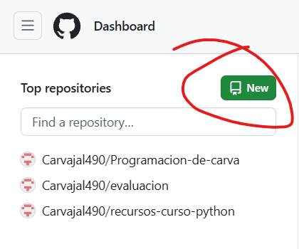
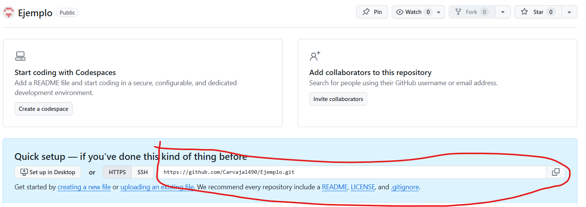
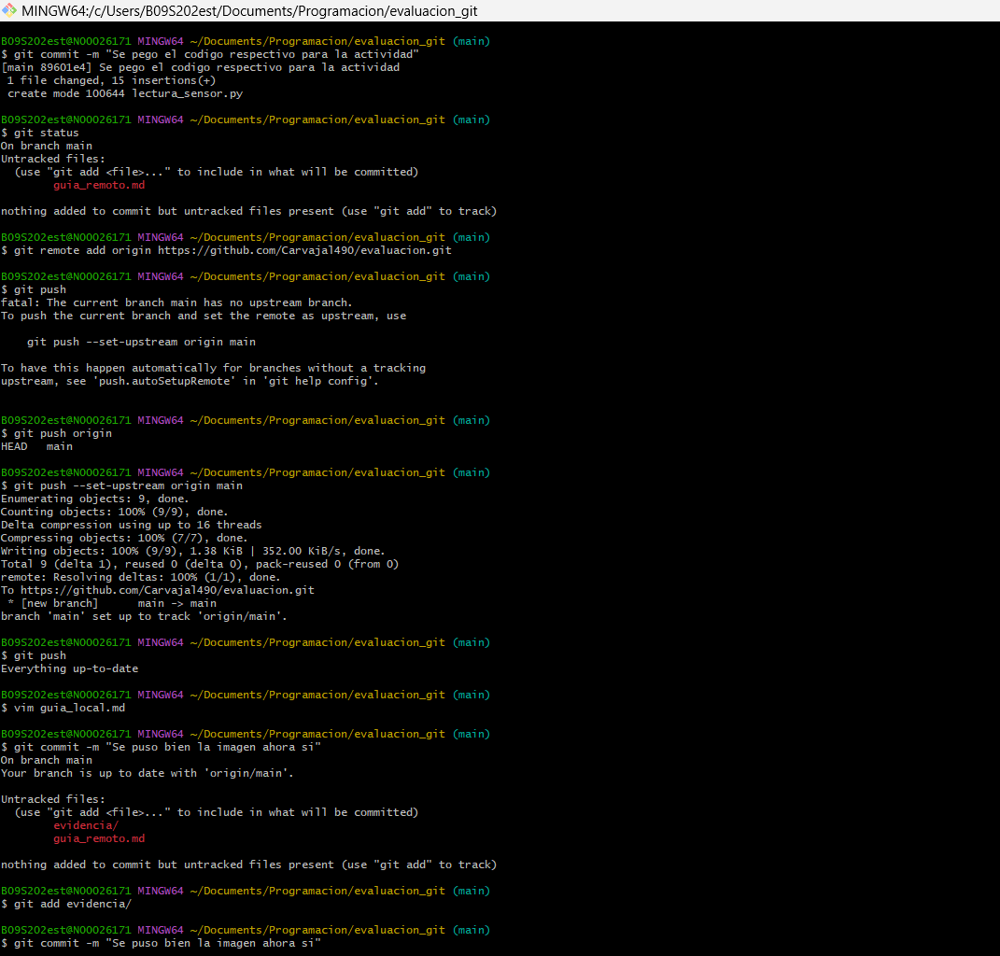

# **Repositorio en la nube**  

se entra a la web de github y le das en crear nuevo repositorio como muestra la imagen

ya luego de poner el nombre se nesesitara el link del repositorio

despues de copiar el link se pone el comando **git remote add origin "link"**
esto se utiliza para enlazar la web con el programa pra poder subir la imformacion
despues te va a pedir volverlo main pa eso y subir la imformacion se pone el comando**git push --set-upstream origin main**
esto lo configura y permite seguir mandado todo lo que hagas de forma local

y asi quedaria todo esto utilizado sin el git pull para enlazar todo

## comandos a utilizar en el uso diario de git bash

*para utilizar de nuevo cualquier imformaciondel repositorio de la nuve se utiliza el comando:*
**git pull**
esto te carga la imformacion a de la nube a la computadora para trabajar
y a despues de trabajar en el codigo para mandarlo de nbuevo a la nube
**git push**

y ya espero que disfrutes 😁😁

